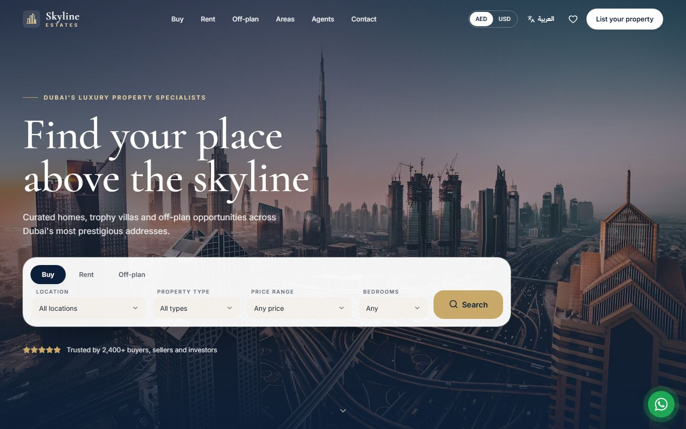
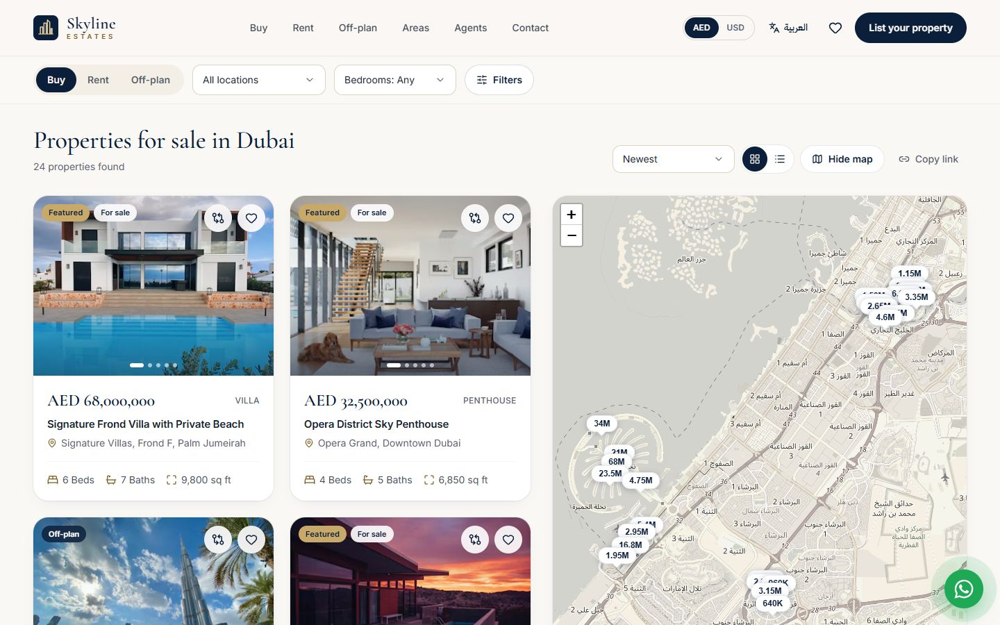
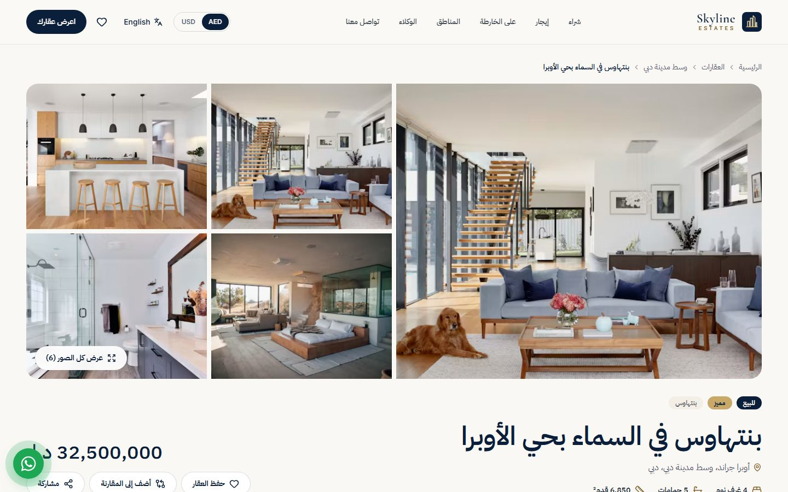

# Skyline Estates

A bilingual (English and Arabic) website for a luxury real estate agency in Dubai. Visitors can browse homes for sale and rent, explore off-plan projects and neighbourhood guides, compare properties side by side and get in touch with an agent, all in a polished, fast and fully responsive experience.

**Live demo:** [realestate.ahmadkhajeh.com](https://realestate.ahmadkhajeh.com)

> Demo project by Ahmad Khajeh — [ahmadkhajeh.com](https://ahmadkhajeh.com). Skyline Estates is a fictional agency; listings, prices and people are illustrative.



## Highlights

- **English and Arabic** with a true right-to-left layout, localized URLs (`/en`, `/ar`) and an instant language switch on every page.
- **AED / USD currency switcher** that updates every price on the site and is remembered between visits.
- **Property search** with filters for purpose, area, type, price, bedrooms, bathrooms, size and amenities. Every filter lives in the URL, so searches can be shared and bookmarked.
- **Interactive map** synced with the results: hover a listing to highlight its pin, or click a price pin to bring the listing into view. On phones the map opens full screen.
- **Rich property pages** with a photo gallery and lightbox, key facts, amenities, floor plan, a location map with nearby schools, malls and metro stations, a mortgage calculator, the listing agent and an inquiry form.
- **Off-plan projects** with payment plans and handover dates, **area guides** with lifestyle highlights and average prices, and **agent profiles** with their active listings.
- **Favorites and compare**: save homes with one tap and compare up to three side by side.
- **Lead capture** forms for viewings, valuations and general enquiries, with validation in both languages and a floating WhatsApp button.
- **Search-engine ready**: per-page titles and descriptions in both languages, social sharing images, structured data for listings and the agency, a sitemap and language alternates.
- **Accessible and fast**: keyboard friendly, screen-reader labelled and optimised for Core Web Vitals.





## Tech stack

- [Next.js](https://nextjs.org) (App Router) and React with TypeScript
- [Tailwind CSS](https://tailwindcss.com) v4 and [shadcn/ui](https://ui.shadcn.com) components
- [next-intl](https://next-intl.dev) for routing, translations and RTL
- [Leaflet](https://leafletjs.com) with OpenStreetMap tiles
- [React Hook Form](https://react-hook-form.com) and [Zod](https://zod.dev) for forms
- [Resend](https://resend.com) for email delivery
- Photography from [Unsplash](https://unsplash.com)

## Run locally

Requires Node.js 20.9 or newer.

```bash
git clone https://github.com/REALAVAT/skyline-estates.git
cd skyline-estates
npm install
npm run dev
```

Then open [http://localhost:3000](http://localhost:3000).
